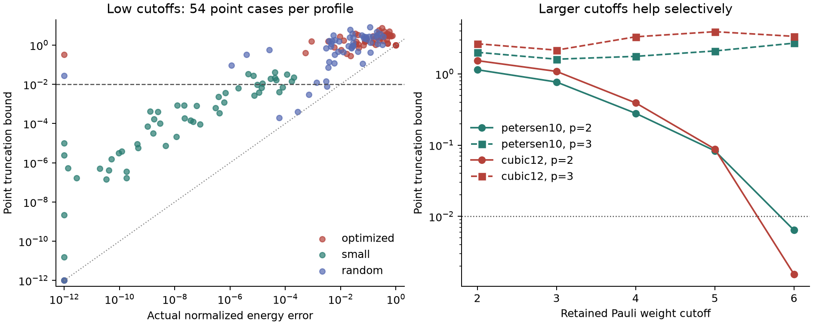

# Tied-angle Pauli truncation: implemented and tested

Assessment: the present certificate is useful as an auditable reference, but the pilot does not support an efficient simulator or optimization method. The small-angle cases are much easier than the optimized centers. Improving the last commuting suffix alone does not repair the dominant error bounds from earlier layers. Signed continuation across discard times captures cancellation, but on the accurate prism example it reaches essentially the full exact Pauli support.

## Method and contract

`../certified_evolution.py` implements a fixed Pauli-weight mask, exact structural terminal-zero removal, shared-parameter derivatives, cumulative discarded-coefficient bounds, and a final commuting-ZZ suffix improvement using graph-component parity and Finner moments. See [CERTIFICATES.md](CERTIFICATES.md) for derivations and primary-source provenance. The weighted IQP formula, Finner inequality, and telescoping bound are established ingredients; no novelty claim is made for them.

The circuit convention is H = sum w_uv Z_u Z_v, with each chronological layer exp(-i beta_l sum X) exp(-i gamma_l H), and input |+>. The default observable is H/sum|w|. For the unweighted pilot, a normalized MaxCut fraction is (1-E)/2, so its absolute error is half the reported normalized energy error. The qubit-zero convention is leftmost in displayed tensor strings. The retained mask is independent of the parameters, making its differentiated surrogate smooth.

Bounds concern truncation in exact arithmetic. NumPy float64 interval calculations do not use directed rounding and are not machine-certified enclosures. Tests allow numerical tolerance. Interval overestimation, dependence between repeated operations, and triangle inequalities can make the bound loose. A returned term-limit failure is an explicit abort, not a hidden approximation.

## Frozen pilot

`certificate_pilot_v1.json` contains 324 completed cases: six graphs (C6, K3,3, triangular prism, cube, Petersen, and a seeded 12-vertex cubic graph), depths 2, 3, 4, weight cutoffs 2, 3, 4, box radii 0 and 0.01, and three angle profiles. Each optimized center is the best of three fixed seeded L-BFGS-B restarts of the exact objective. These are locally optimized centers, not certified global optima. Small angles are sampled from [-0.05,0.05]; random angles from [-0.6,0.6]. Graphs, centers, seeds, optimization calls and kernel hashes are saved.

For the 54 point cases in each profile, a truncation bound at most 0.01 is obtained in 1 optimized, 44 small-angle, and 5 random cases. The corresponding counts for maximum componentwise gradient bound at most 0.05 are 1, 29, and 2. These are retrospective illustrative tolerances, not preregistered success criteria. The optimized-case median actual energy error is 0.170 and the median bound is 1.702; small-angle medians are 2.21e-8 and 2.66e-4. Thus the difficult optimized cases involve both inaccurate low-weight surrogates and loose certificates.

`certificate_high_weight_v2.json` adds 48 completed optimized-center cases at depths 2 and 3, cutoffs 5 and 6, and both radii, reusing the earlier saved centers. Ten of 24 point cases meet the 0.01 energy tolerance; that count includes exact full-weight cases on six-qubit graphs. A substantive partial-weight example is Petersen p=2, cutoff6: actual error 0.000740 and point/box bounds 0.00641/0.00957, compared with l1 bounds 0.279/0.380. The 12-vertex cubic p=2 cutoff6 gives actual error 0.0000777 and bounds 0.00155/0.00223. At p=3 on that graph, the point bound is 3.36 despite actual error 0.00722, at roughly 45 seconds per certificate call. Exact small-state evaluation takes milliseconds.



The plot places zero or sub-1e-12 values at 1e-12. The left panel contains point bounds only; the right panel compares fixed optimized workloads as the mask grows. `pilot_summary.json` and `analyze_pilot.py` provide the aggregate records and regenerate this figure directly from frozen inputs.

The main pilot times include value, gradient and interval-bound work. Its exact baseline additionally builds the QFI while obtaining the gradient. Those timings are implementation measurements, not a controlled comparison of optimal algorithms. The separate residual experiment uses the same scalar kernel for all Pauli representations and charges exact-state oracle work separately.

## Independent audit and discriminating negative experiment

The [audit package](diagnostics/audit/AUDIT.md) preserves 54 independent dense-state tests and 270 box-point probes of arbitrary Hermitian observables, plus exact operator-norm and exact state-aware discard-batch diagnostics. It found a parallel-edge defect in the public helper of archived v1; the supported current helper now combines parallel weights and has a regression test. The main pilot uses unique graph edges and is unaffected. Archived source copies intentionally preserve the old implementation for reproduction and must not be imported as the supported API.

At prism p=4 cutoff4, actual error is 0.009449, while the implemented bound is 2.789. Replacing each early discarded batch by its exact spectral norm still gives 1.019; replacing it by its exact state-aware scalar magnitude gives a total 0.124978. This identifies cancellation between different discard times as a necessary ingredient for a sharp certificate on that example under this decomposition.

The [signed residual experiment](diagnostics/residual/RESULTS.md) leaves the original surrogate fixed and propagates discarded signed terms without secondary truncation for one, two, or all backward layers. Only the all-layer continuation reaches 0.01 on the prism. Its peak residual expansion has 2,046 terms, equal to exact Pauli propagation; retained plus residual propagation visits 95,869 input terms versus 69,128 for exact propagation. K3,3 p4 and cube p3 have actual surrogate errors 0.245 and 0.377, so no sharper certificate can make those fixed surrogates accurate. No box or gradient extension is claimed for this residual experiment.

Recommendations: stop polishing this particular terminal-suffix certificate as a proposed scalable QAOA method. A future proposal needs a different retained representation or error decomposition that certifies a fixed target at lower total cost than exact statevector/lightcone/Pauli propagation on matched workloads. The present data do not rule out other graphs, masks, orderings, depths, compressed residuals or parameter regimes. They do rule out claiming an observed advantage from this pilot.

## Reproduction

From the repository root, use Python 3.13 with NumPy 2.5.3, SciPy 1.18.1, NetworkX 3.6.1 and Matplotlib 3.11.1 for the archived pilot environment. The regression suite additionally uses pytest and Qiskit; optional optimizer checks use cmaes. The audit and code scripts do not require external services.

```sh
python -m pytest -q
python research/validate_suffix.py
python research/analyze_pilot.py
python -B research/diagnostics/audit/probe.py
python -B research/diagnostics/audit/group_diagnostic.py
python -B research/diagnostics/audit/scalar_diagnostic.py
python -B research/diagnostics/residual/experiment.py
```

To recompute the complete first pilot, select a fresh output path. The command below uses the exact archived kernels, which are hash-checked before any resumed run. The optimization results can vary slightly across numerical library versions; the saved centers in the committed JSON are the authoritative inputs to the recorded comparisons.

```sh
python research/run_certificate_pilot.py --kernel-version v1 --graphs cycle6 k33 prism6 cube8 petersen10 cubic12 --depths 2 3 4 --cuts 2 3 4 --radii 0 .01 --profiles optimized small random --output /tmp/certificate_pilot_rerun.json
```

For a small supported-current-kernel check, use `python research/run_certificate_pilot.py --graphs cycle6 --depths 2 --cuts 3 --radii 0 .01 --profiles optimized --output /tmp/current_certificate_smoke.json`. Reusing an output whose kernel hashes differ fails explicitly. Do not edit frozen v1/v2 source snapshots to make a resume succeed.
